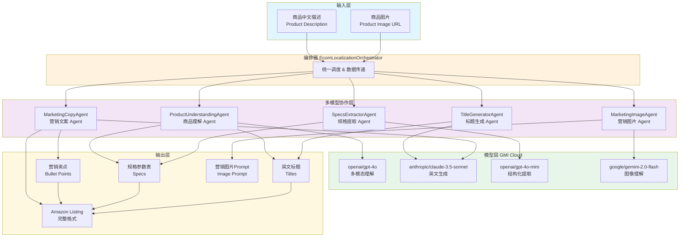

```mermaid
graph TB
    subgraph Input[输入层]
        A[商品中文描述<br/>Product Description]
        B[商品图片<br/>Product Image URL]
    end

    subgraph Orchestrator[编排器 EcomLocalizationOrchestrator]
        direction TB
        C[统一调度 & 数据传递]
    end

    subgraph Agents[多模型协作层]
        direction LR
        D[ProductUnderstandingAgent<br/>商品理解 Agent]
        E[TitleGeneratorAgent<br/>标题生成 Agent]
        F[SpecsExtractorAgent<br/>规格提取 Agent]
        G[MarketingCopyAgent<br/>营销文案 Agent]
        H[MarketingImageAgent<br/>营销图片 Agent]
    end

    subgraph Models[模型层 GMI Cloud]
        I[openai/gpt-4o<br/>多模态理解]
        J[anthropic/claude-3.5-sonnet<br/>英文生成]
        K[openai/gpt-4o-mini<br/>结构化提取]
        L[google/gemini-2.0-flash<br/>图像理解]
    end

    subgraph Output[输出层]
        M[英文标题<br/>Titles]
        N[规格参数表<br/>Specs]
        O[营销卖点<br/>Bullet Points]
        P[营销图片Prompt<br/>Image Prompt]
        Q[Amazon Listing<br/>完整格式]
    end

    A --> C
    B --> C
    C --> D
    C --> E
    C --> F
    C --> G
    C --> H

    D --> I
    E --> J
    F --> K
    G --> J
    H --> L

    D --> M
    D --> N
    E --> M
    F --> N
    G --> O
    G --> Q
    H --> P
    O --> Q
    N --> Q
    M --> Q

    style Input fill:#e1f5fe
    style Orchestrator fill:#fff3e0
    style Agents fill:#f3e5f5
    style Models fill:#e8f5e9
    style Output fill:#fff8e1
```